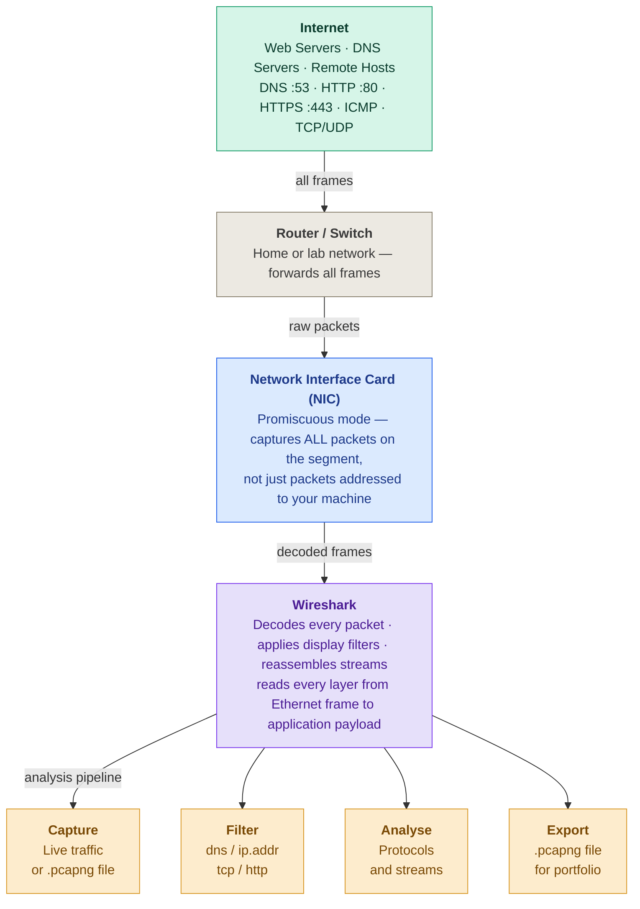

# Lab 2 — Wireshark & Network Traffic Analysis

> Hands-on packet capture and protocol analysis using Wireshark. Captures and dissects DNS lookups, the TCP three-way handshake, cleartext HTTP credentials, and full TCP stream reassembly — the foundational skill set behind network troubleshooting, SOC analysis, and cloud network forensics.


---

## Table of Contents

- [Overview](#overview)
- [Architecture — How Wireshark Captures Traffic](#architecture--how-wireshark-captures-traffic)
- [Why This Matters](#why-this-matters)
- [Key Concepts](#key-concepts)
- [Prerequisites](#prerequisites)
- [Lab Walkthrough](#lab-walkthrough)
  - [Step 1 — Install Wireshark](#step-1--install-wireshark)
  - [Step 2 — Your First Capture](#step-2--your-first-capture)
  - [Step 3 — Essential Display Filters](#step-3--essential-display-filters)
  - [Step 4 — Guided Exercises](#step-4--guided-exercises)
  - [Step 5 — Save & Export Captures](#step-5--save--export-captures)
- [Verification](#verification)
- [Repository Structure](#repository-structure)
- [Skills Demonstrated](#skills-demonstrated)
- [Legal & Ethical Notice](#legal--ethical-notice)

---

## Overview

| Field | Value |
|---|---|
| **Lab focus** | Live packet capture and protocol analysis |
| **Tool** | Wireshark — free, open source, no account required |
| **Environment** | Local machine or Azure VM |
| **Time to complete** | 2–4 hours across multiple sessions |
| **Cost** | $0 — Wireshark is permanently free |
| **Certification alignment** | CompTIA Network+ · Security+ · CySA+ |
| **Career relevance** | Network Engineer · SOC Analyst · Cloud Security Engineer · Incident Responder |

---

## Architecture — How Wireshark Captures Traffic

Traffic flows from the internet, through the local network, into the host's network interface card (NIC), and finally into Wireshark for decoding and analysis. Understanding this path is what makes the rest of the lab click — Wireshark sits at the NIC and reads every frame the interface sees.



> **Legend:** 🟢 Network traffic · 🔵 Capture layer · 🟣 Wireshark engine · 🟠 Analysis pipeline
>
> A static copy of this diagram is also included at [`architecture.png`](architecture.png).

---

## Why This Matters

Networks carry every piece of data an organisation produces — emails, database queries, credentials, file transfers, API calls. When something breaks (a service is unreachable, performance degrades, a security alert fires), the network is almost always involved, and the only way to know what is *actually* happening is to look at the packets. Wireshark captures raw data crossing a network interface and lets you inspect it at every layer, from the physical frame up to the application payload.

| Role | How this lab applies |
|---|---|
| **Network Engineer** | Diagnose connectivity issues by seeing exactly where packets are dropped or delayed |
| **SOC Analyst** | Identify malicious traffic patterns and extract indicators of compromise from captures |
| **Cloud Security Engineer** | The mental model transfers directly to reading Azure Network Watcher and VPC flow logs |
| **Help Desk** | Prove a reported network issue is real and isolate whether it is client- or server-side |

---

## Key Concepts

<details>
<summary><b>What is a packet?</b></summary>

A packet is a small unit of data that travels across a network. Data isn't sent as one whole piece — it's broken into many smaller packets. Each has a **header** (source IP, destination IP, port number) and a **payload** (the actual data). Packets travel independently, potentially via different routes, and reassemble at the destination. Wireshark shows you each individual packet.
</details>

<details>
<summary><b>What is a network protocol?</b></summary>

A set of rules defining how data is formatted and transmitted. Different protocols handle different jobs: **DNS** resolves domain names to IPs, **HTTP** transfers web content, **TCP** ensures reliable delivery, **ICMP** handles ping/diagnostics. Each has its own port number and packet structure. In Wireshark you filter by protocol to isolate the traffic you care about.
</details>

<details>
<summary><b>What is the TCP three-way handshake?</b></summary>

Before two hosts exchange data over TCP, they perform a three-step setup:
1. **SYN** — "I want to connect."
2. **SYN-ACK** — "I received your request, here is my acknowledgement."
3. **ACK** — "Connection confirmed, ready to send data."

A SYN with no SYN-ACK means the connection was refused or the server is unreachable — one of the most useful things to look for when diagnosing connectivity.
</details>

<details>
<summary><b>What is DNS?</b></summary>

The Domain Name System translates human-readable names (`google.com`) into IP addresses (`142.250.80.46`). A query happens before nearly every website visit, app launch, or email. In Wireshark you can see the **query** ("what is the IP for this domain?") and the **response** (the answer). If DNS breaks, nothing works.
</details>

<details>
<summary><b>HTTP vs HTTPS</b></summary>

**HTTP** is unencrypted — anyone on the network path can read every request and response, including credentials. **HTTPS** wraps HTTP in TLS encryption so captured packets are unreadable. This lab demonstrates cleartext credentials in an HTTP capture — exactly why HTTPS became the standard.
</details>

<details>
<summary><b>What is promiscuous mode?</b></summary>

Normally a NIC only captures packets addressed to your machine. In **promiscuous mode** it captures every packet on the network segment. Wireshark enables this automatically. On modern switched networks you'll mainly see your own traffic plus broadcasts; on hub-based networks or with port mirroring, you can see the whole segment.
</details>

---

## Prerequisites

- A machine running Windows, macOS, or Linux (or an Azure VM)
- Administrator/root access to install the packet capture driver
- A terminal/command prompt for generating test traffic
- **Authorisation to capture on the network you are testing** — see the [Legal & Ethical Notice](#legal--ethical-notice)

---

## Lab Walkthrough

### Step 1 — Install Wireshark

Download from [wireshark.org/download.html](https://www.wireshark.org/download.html). No account, trial, or licence required.

| OS | Download | Notes |
|---|---|---|
| **Windows** | Windows x64 Installer (`.exe`) | Accept defaults. **Install Npcap when prompted** — required to capture packets |
| **macOS** | macOS Arm or Intel (`.dmg`) | Run the installer. Allow **ChmodBPF** if prompted — grants interface access |
| **Linux** | Package manager | `sudo apt install wireshark` (Ubuntu/Debian) |

```bash
# Linux only — add yourself to the wireshark group (log out and back in after)
sudo usermod -aG wireshark $USER

# Verify the installation
wireshark --version
```

### Step 2 — Your First Capture

Get comfortable with the interface before doing anything complex.

1. Open Wireshark.
2. On the welcome screen, note the network interfaces with wavy lines showing live activity.
3. Double-click your active interface (Ethernet or Wi-Fi — pick the one with the most activity).
4. Capture starts immediately; packets appear in real time.
5. Open a browser and visit any website.
6. After ~30 seconds, click the red square **Stop** button.

> You now hold a packet capture in memory containing every frame that crossed the interface. The volume is overwhelming on purpose — that's exactly why display filters exist.

### Step 3 — Essential Display Filters

Type a filter into the bar at the top and press **Enter**. The packet list updates instantly.

> **Display filters vs capture filters:** *Capture* filters limit what gets recorded (applied before capture). *Display* filters limit what you see without discarding anything (applied after). This lab uses **display filters** so you can re-examine the same capture through different lenses.

| Filter | What it shows | When to use it |
|---|---|---|
| `dns` | All DNS queries and responses | Troubleshooting name resolution, spotting unusual lookups |
| `http` | Unencrypted HTTP only | Finding cleartext data, debugging web apps |
| `tcp` | All TCP traffic | Starting point for connectivity investigations |
| `tcp.flags.syn == 1` | TCP SYN packets (connection attempts) | Seeing which hosts try to connect to what |
| `tcp.flags.reset == 1` | TCP RST packets (resets) | Finding refused or forcibly closed connections |
| `icmp` | All ICMP including ping | Verifying basic reachability |
| `ip.addr == 192.168.1.1` | Traffic to/from a specific IP | Isolating one host in a busy capture |
| `ip.src == 10.0.0.5` | Traffic from a specific source | Isolating outbound traffic from one host |
| `tcp.port == 443` | All HTTPS traffic | Identifying encrypted web traffic by port |
| `http.request` | HTTP GET/POST requests only | Spotting web requests / potential exfiltration |

### Step 4 — Guided Exercises

Work through these in order; each builds on the last.

#### Exercise A — Capture a DNS Lookup

> **`nslookup`** is a built-in CLI tool that performs a DNS lookup on demand — perfect for generating traffic Wireshark can capture. Run it in a **separate terminal**, not inside Wireshark (Wireshark has no terminal). An **A record** maps a domain to an IPv4 address (record type `1`).

**Open a terminal:** Windows → `Win` then type `cmd` · macOS → `Cmd+Space` then `Terminal` · Linux → `Ctrl+Alt+T`

1. In Wireshark, start a capture on your active interface (blue shark-fin icon).
2. In a separate terminal, run:
   ```bash
   nslookup google.com
   ```
3. The terminal shows the returned IP(s) — confirming the lookup worked.
4. Back in Wireshark, click **Stop**.
5. Apply the filter `dns`.
6. Find the **query**: Info column shows `Standard query A google.com`.
7. Find the **response**: `Standard query response A google.com`.
8. Select the response → expand **Domain Name System (response)** → **Answers** → confirm the A record IP matches your terminal output.

> **What you saw:** Your machine asked for the A record, the server replied with an IP, and your browser used it to connect. This invisible lookup precedes every website visit, API call, and email. In the real world, unexpected DNS queries to unusual domains are often the first sign of malware calling home to a command-and-control server.

#### Exercise B — Watch the TCP Three-Way Handshake

1. Start a capture.
2. Visit `http://example.com` (HTTP, not HTTPS — easier to see).
3. Stop the capture.
4. Run `nslookup example.com` to get the IP, then filter: `tcp and ip.addr == [that IP]`.
5. Find three packets in order:

| Packet | Flags | Meaning |
|---|---|---|
| 1st | `SYN` | Your machine: *I want to connect. Here's my sequence number.* |
| 2nd | `SYN, ACK` | Server: *Got your request. Here's mine. Connection accepted.* |
| 3rd | `ACK` | Your machine: *Got it. Connection open. Ready to send data.* |

> A SYN with no SYN-ACK → connection refused or server unreachable. A RST → connection forcibly closed. These two patterns are the most common things engineers look for when diagnosing connectivity.

#### Exercise C — Spot Cleartext Credentials (HTTP)

> ⚠️ **Educational use only.** Only capture on networks and against systems you own or have explicit written permission to analyse.

1. Set up a test HTTP login form locally, or use a known HTTP (non-HTTPS) test site.
2. Start a capture.
3. Submit the login form with a **test** username and password.
4. Stop the capture.
5. Filter: `http.request.method == POST`.
6. Select the POST packet → find the **HTML Form URL Encoded** layer.
7. The username and password appear in **plaintext**.

> This is why every login form must use HTTPS. Without TLS, anyone on the network path — your ISP, a coffee-shop router, a man-in-the-middle — can read credentials exactly as typed. Wireshark is how security teams prove this to developers who resist adding HTTPS.

#### Exercise D — Follow a Full TCP Stream

1. Capture HTTP traffic by visiting an HTTP site.
2. Find any HTTP packet.
3. Right-click → **Follow → TCP Stream**.
4. Wireshark reassembles the connection into a readable conversation.
5. **Red** = your browser's request · **Blue** = the server's response.

> This is how incident responders reconstruct a network event. Individual packets are fragments; the stream view shows the complete conversation — what data was transferred, what commands were sent, and how the server responded.

### Step 5 — Save & Export Captures

Always save interesting captures — they are evidence of your skills and your portfolio entries.

```text
# Save a capture for later analysis
File → Save As → choose .pcapng format

# Export only the packets matching your current filter
Apply your display filter first
File → Export Specified Packets → Displayed

# Re-open a saved capture
File → Open → select your .pcapng file
```

```bash
# Command-line capture with tshark (ships with Wireshark — great for remote servers)
tshark -i eth0 -w capture.pcapng -c 1000
#   -i  interface name   -w  output file   -c  stop after N packets
```

---

## Verification

| Skill | How to verify |
|---|---|
| **DNS capture** | Apply `dns`; identify a query and its response with matching transaction IDs |
| **TCP handshake** | Find SYN → SYN-ACK → ACK and explain each from memory |
| **Display filters** | Filter by IP, port, and protocol without looking them up |
| **Stream reconstruction** | Follow a TCP stream and read the full request/response as a conversation |
| **File management** | Save a capture, close and reopen Wireshark, confirm all packets load |

---

## Repository Structure

```text
.
├── README.md
├── architecture.png            # Static copy of the capture-flow diagram
└── captures/
    ├── dns-lookup.pcapng        # Exercise A — DNS query + response
    ├── tcp-handshake.pcapng     # Exercise B — SYN / SYN-ACK / ACK
    └── tcp-stream.pcapng        # Exercise D — full reassembled stream
```

> Save three captures — a DNS lookup, a TCP handshake, and a stream follow — into `captures/` as concrete, demonstrable evidence of network-analysis skill.

---

## Skills Demonstrated

- Capturing live network traffic on a chosen interface
- Writing and applying Wireshark display filters by protocol, IP, port, and TCP flag
- Reading the TCP three-way handshake and recognising failed/refused connections
- Identifying DNS queries and responses and inspecting A records
- Demonstrating the risk of cleartext HTTP credentials (and why HTTPS matters)
- Reassembling and reading full TCP streams for incident reconstruction
- Saving, filtering, and exporting `.pcapng` evidence from the GUI and via `tshark`

---

## Legal & Ethical Notice

This lab is for **educational purposes only**. Packet capture can expose sensitive data. Only capture traffic on networks and systems you **own** or have **explicit written authorisation** to analyse. Unauthorised interception of network traffic may violate computer-misuse, wiretap, and privacy laws in your jurisdiction. The credential-capture exercise must only be performed against a test form you control. You are responsible for using these techniques lawfully and ethically.
